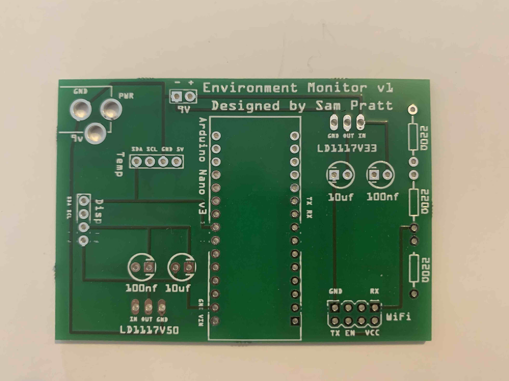

# What

A custom PCB to form the basis of a Mini Weather station that can upload to the internet.

This will upload to a Cloud Solution

# Where did you get it made?

The board was manufactured via Aisler in Germany. It took about a week from ordering to delivery and cost approx. £22.

https://aisler.net/

# Contents: -

An Arduino nano. This is connected to the following: -
* A Serial connection to an ESP-01 Wifi Module
* An i2c connection to a BME280 Sensor
* An i2c connection to an OLED display
* 2 x Regulators to bring the 9v input down to: -
** 5v for the Temp Sensor and display
** 3.3v for the ESP-01

# What do I need to build this?

* Arduino Nano: https://www.amazon.co.uk/gp/product/B072BMYZ18
* BME280 board: https://www.amazon.co.uk/gp/product/B07KY8WY4M
* Generic Mini I2C 128x64 OLED Display with a SSD1306 controller: https://www.amazon.co.uk/gp/product/B076PNP2VD
* LD1117v50: https://uk.rs-online.com/web/p/low-dropout-voltage-regulators/6869760/
* LD1117v33: https://uk.rs-online.com/web/p/low-dropout-voltage-regulators/4384885/?sra=pmpn
* 10uF Capacitor x 2: https://uk.rs-online.com/web/p/aluminium-capacitors/4758848
* 100nf Capacitor x 2: https://uk.rs-online.com/web/p/aluminium-capacitors/8624146/
* 9V Connector: https://uk.rs-online.com/web/p/dc-power-connectors/1631836/
* 9V Power Supply: https://uk.rs-online.com/web/p/ac-dc-adapters/1753309/
* Some Generic 4 Pin headers and a Socket for the ESP-01: https://www.amazon.co.uk/gp/product/B072FLGDXQ
* Dupont wires for the display: https://www.amazon.co.uk/gp/product/B08151TQHG
* 3 x 220ohm resistors https://uk.rs-online.com/web/p/through-hole-fixed-resistors/0148348/

# What did I learn / what would I do differently?

## Regulator Design

The ESP-01 is quite power hungry and so the LD1117V33 is having to disapate over 1W of power. This means it gets quite hot.
More than 50degC above ambient. I had to use a heat sink as it was too hot to touch. If I did this again I would put the 5v and 3.3v Regulator in series. That way the heat would shared between them.

## Choice of board

The ESP-01 actually contains a 32bit ARM CPU that is far more powerful than the 8bit AT Mega CPU on the Arduino.
You can get Nano style development boards with i2c and GPIO pins (https://www.amazon.co.uk/AZDelivery-ESP-32-Dev-including-eBook/dp/B07Z83MF5W). It would be much easier to build the board around one of these.

## Temp Sensor

The temp sensor in the BME280 isn't very accurate. This is because it mainly exists to assist the humidity sensor. Mine read consistantly ~1.5 deg above true temperature. If I did this again I would use a seperate dedicated analogue sensor.

## Mounting Holes

I forgot to put any on the board when it was manufactured. I will have to drill some myself to mount it.

# Voltage Conversion

Altough the resistors work for the 5v -> 3.3v conversion on the Arduino TX -> ESP-01 RX a better solution would be to use a way level converter IC.

# What does this look like?

Design in Fritzing: -

Raw board: -

Built Up and working: -

# Why are there no hold up resistors on the I2C lines?

There are some integrated into the BME280 board I used.
